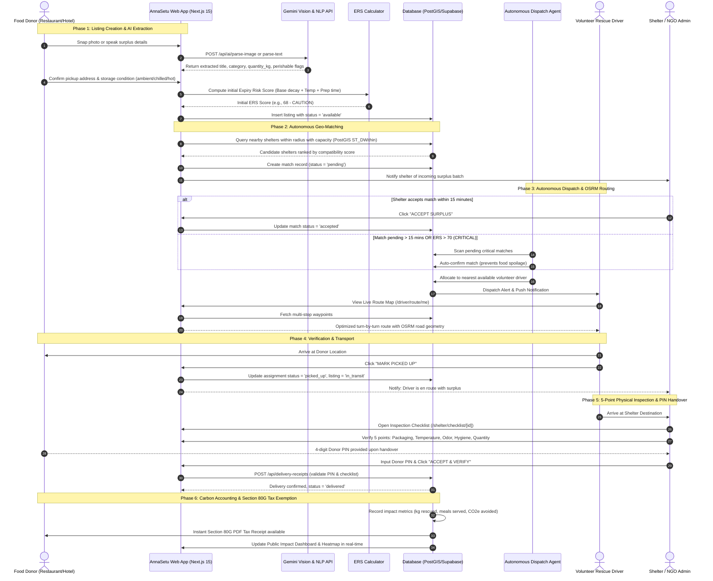
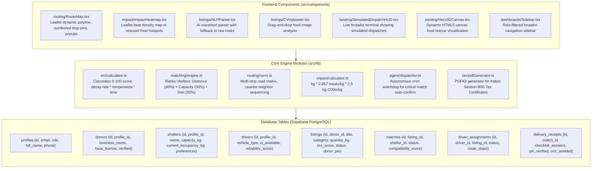
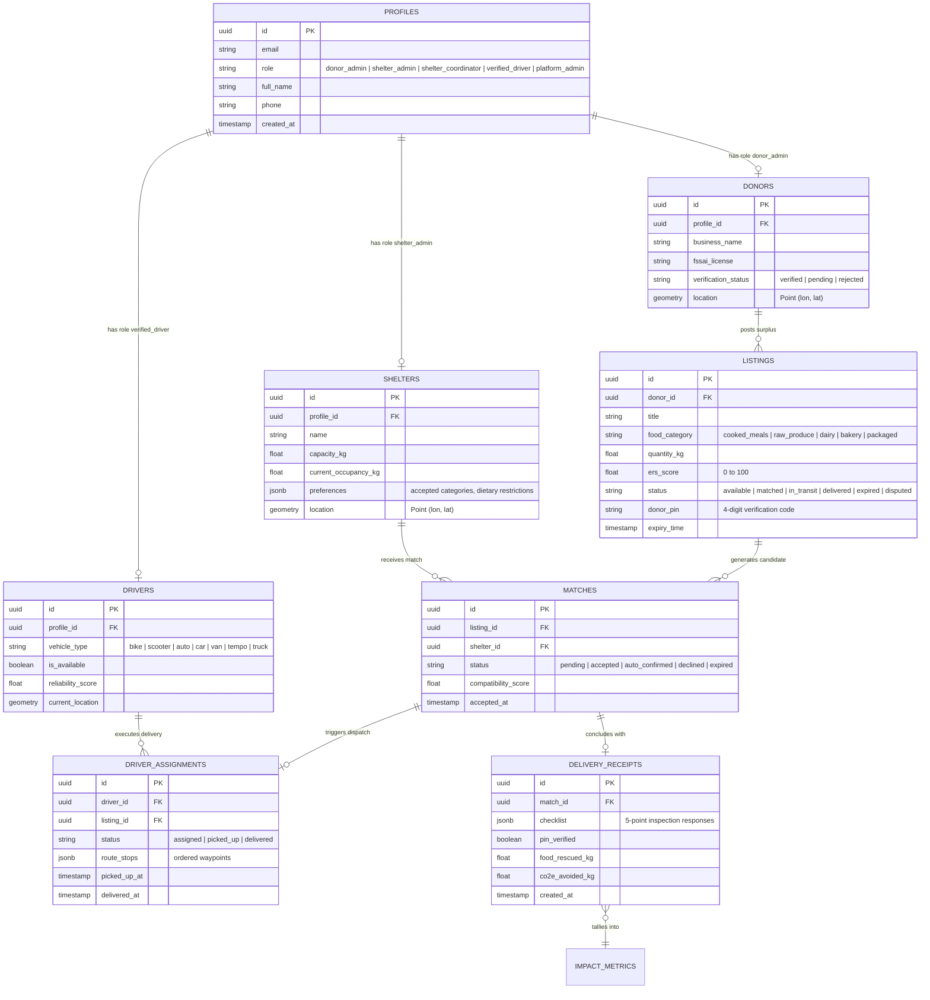

# AnnaSetu — End-to-End System Architecture

**Platform:** Real-Time AI-Powered Surplus Food Redistribution & Rescue Network  
**Technology Stack:** Next.js 15 (App Router, React 19, TypeScript), Tailwind CSS v4 (Neo-brutalist design system), Leaflet.js, Supabase (PostgreSQL 15 + PostGIS), Upstash Redis, BullMQ, Google Gemini 1.5, OSRM Routing Engine, React Email, PDFKit.

---

## 1. High-Level Architecture Diagram

```mermaid
graph TB
    subgraph CLIENT_LAYER["1. CLIENT & PRESENTATION LAYER (Next.js 15 App Router)"]
        direction TB
        subgraph PUBLIC_SURFACE["Public Web Portal"]
            P1["Landing Page with 3D Canvas<br/>(Hero3DCanvas & Dispatch HUD)"]
            P2["ERS Interactive Simulator<br/>(ErsInteractiveSimulator)"]
            P3["Public Impact Heatmap<br/>(ImpactHeatmap - Leaflet.heat)"]
            P4["Interactive FAQ & Legal<br/>(Terms & Privacy Policies)"]
        end

        subgraph ROLE_DASHBOARDS["Role-Gated Dashboards"]
            D1["Donor Dashboard (/donor)<br/>- AI Food Lister & Relist<br/>- 80G Tax Certificates<br/>- Live ERS Countdown Badges"]
            D2["Shelter / NGO Dashboard (/shelter)<br/>- Incoming Match Acceptance<br/>- Dedicated Capacity Mgmt<br/>- Preferences & Inspection"]
            D3["Volunteer Driver (/driver)<br/>- Online/Offline Toggle<br/>- Embedded Live Route Map<br/>- Fullscreen Route (/driver/route/me)"]
            D4["Network Coordinator (/coordinator)<br/>- Multi-NGO Network Overview<br/>- Redistribution Analytics<br/>- Capacity & Delivery Monitoring"]
            D5["Platform Admin (/admin)<br/>- FSSAI Verification Queue<br/>- Autonomous Agent Logs<br/>- System Health & Listings"]
        end
    end

    subgraph GATEWAY_LAYER["2. ROUTING, AUTH & EDGE MIDDLEWARE"]
        MW["Next.js Edge Middleware (src/middleware.ts)<br/>- Role Guard Matrix & Path Protection<br/>- JWT Verification (Supabase Auth / LocalStore HMAC)<br/>- Route Canonicalization & Redirects"]
    end

    subgraph API_LAYER["3. API & BUSINESS LOGIC LAYER (/api/**)"]
        direction TB
        subgraph AUTH_APIS["Authentication & Accounts"]
            API_AUTH["/api/auth/[login | register | refresh]"]
            API_DRIVER["/api/drivers/[availability | route]"]
            API_SHELTER["/api/shelter (Capacity & Preferences)"]
        end

        subgraph RESCUE_APIS["Core Rescue Operations"]
            API_LIST["/api/listings (Create, Relist, Lifecycle)"]
            API_MATCH["/api/matches/[accept | decline]"]
            API_ASSIGN["/api/driver-assignments/[pickup | deliver]"]
            API_RECEIPT["/api/delivery-receipts (5-Point Checklist + PIN)"]
        end

        subgraph INTELLIGENCE_APIS["AI & Reporting APIs"]
            API_AI["/api/ai/[parse-image | parse-text]"]
            API_TAX["/api/donors/[id]/certificate (PDFKit 80G)"]
            API_IMPACT["/api/impact (Real-time Analytics)"]
        end
    end

    subgraph CORE_ENGINES["4. DOMAIN ENGINES & ALGORITHMS"]
        direction LR
        ENG_ERS["ERS Engine (0-100)<br/>- Base Decay Rates<br/>- OpenWeatherMap Ambient Temp<br/>- Storage & Time Decay Multipliers"]
        ENG_MATCH["Matching Engine<br/>- PostGIS / Haversine Distance<br/>- Capacity & Diet Fit<br/>- Urgency & Proximity Scoring"]
        ENG_ROUTE["OSRM Routing Optimizer<br/>- Road Matrix Calculation<br/>- Pickup-Before-Delivery Precedence<br/>- ERS Urgency Prioritization"]
        ENG_IMPACT["Impact & ESG Engine<br/>- kg Food Rescued<br/>- Meals Served (0.35kg/meal)<br/>- CO2e Avoided (2.5kg/kg)"]
        ENG_AGENT["Autonomous Dispatcher Agent<br/>- Background Watchdog (2-min cron)<br/>- Critical ERS Auto-Confirm<br/>- Autonomous Driver Dispatch"]
    end

    subgraph AI_SERVICES["5. EXTERNAL AI & EXTERNAL SERVICES"]
        GEMINI_V["Google Gemini 1.5 Vision<br/>(Computer Vision Food Classifier)"]
        GEMINI_T["Google Gemini 1.5 Flash<br/>(NLP Voice & Text Listing Parser)"]
        OSRM["OSRM Project API<br/>(OpenStreetMap Road Distance Matrix)"]
        WEATHER["OpenWeatherMap API<br/>(Live Ambient Metro Temperature)"]
        SMTP["SMTP Transporter<br/>(Nodemailer & React Email Templates)"]
    end

    subgraph QUEUE_JOBS["6. ASYNCHRONOUS WORKERS & QUEUES"]
        REDIS["Upstash Redis<br/>(BullMQ Job Store & Rate Limiter)"]
        BULLMQ["BullMQ Queue Workers<br/>- ERS Re-index Cron (15 min)<br/>- Autonomous Dispatch Agent Cron (2 min)<br/>- Email Dispatch Queue<br/>- Donor Impact Digest Cron"]
    end

    subgraph DATA_LAYER["7. PERSISTENCE & DATA STORAGE LAYER"]
        direction TB
        subgraph SUPABASE_LIVE["Supabase (Production / Live Cloud)"]
            PG["PostgreSQL 15 + PostGIS<br/>(Entities: Profiles, Listings, Shelters, Drivers, Matches, Receipts)"]
            SB_AUTH["Supabase Auth (JWT & GoTrue)"]
            SB_STORAGE["Supabase Storage (FSSAI Docs & Food Photos)"]
            SB_RLS["Row-Level Security Policies"]
        end
        subgraph LOCAL_STORE["Zero-Dependency Local Fallback (Offline / Dev)"]
            MOCK_CLIENT["Mock Supabase Client (src/lib/supabase/mockClient.ts)"]
            LOCAL_STORE_JWT["LocalStore In-Memory State & HMAC JWTs"]
        end
    end

    %% Wiring Connections
    CLIENT_LAYER --> MW
    MW --> API_LAYER

    API_AI --> GEMINI_V
    API_AI --> GEMINI_T
    API_LIST --> ENG_ERS
    API_LIST --> ENG_MATCH
    API_DRIVER --> ENG_ROUTE
    API_RECEIPT --> ENG_IMPACT

    ENG_ERS --> WEATHER
    ENG_ROUTE --> OSRM
    ENG_AGENT --> API_MATCH
    ENG_AGENT --> API_ASSIGN

    API_LAYER --> BULLMQ
    BULLMQ --> REDIS
    BULLMQ --> SMTP

    API_LAYER --> DATA_LAYER
```

---

## 2. Real-Time Food Rescue Data Flow Sequence

The diagram below details the entire operational lifecycle of a surplus food donation—from initial post to final shelter inspection and carbon accounting.

---

## 3. Core Subsystems & Component Topology

---

## 4. Entity-Relationship Data Model (ERD)

---

## 5. Security, Role-Based Access Control (RBAC) & Route Matrix

| Role | Permitted Route Prefixes | Destination on Login | Primary Responsibilities |
| :--- | :--- | :--- | :--- |
| **Food Donor** (`donor_admin`, `donor_staff`) | `/donor/*`, `/profile`, `/settings` | `/donor` | Post surplus food, view listings, print 80G tax exemptions |
| **Shelter Admin** (`shelter_admin`) | `/shelter/*`, `/profile`, `/settings` | `/shelter` | Accept matches, update intake capacity & dietary preferences, inspect food |
| **Network Coordinator** (`shelter_coordinator`) | `/coordinator/*`, `/shelter/*`, `/profile` | `/coordinator` | Regional oversight across multiple shelters & donor networks, redistribution telemetry |
| **Volunteer Driver** (`verified_driver`, `casual_volunteer`) | `/driver/*`, `/profile`, `/settings` | `/driver` | Toggle availability, follow optimized multi-stop route map, confirm pickups |
| **Platform Admin** (`platform_admin`, `super_admin`) | `/admin/*`, `/donor/*`, `/shelter/*`, `/driver/*` | `/admin` | Verify FSSAI licenses, monitor autonomous dispatcher logs, audit system health |
| **Public / Anonymous** | `/`, `/login`, `/register`, `/public-impact`, `/terms`, `/privacy` | `/` | Explore mission, test ERS simulator, view live impact, register account |

---

## 6. Resilience, Fallback & Offline Strategies

1. **Routing Engine Resilience**:
   - **Primary**: OSRM Driving Matrix API computes exact road travel distances and traffic durations.
   - **Fallback**: Haversine formula augmented with an urban winding factor of `1.35x` and an average speed of `25 km/h` kicks in immediately if OSRM times out (3-second circuit breaker).
2. **AI Engine Graceful Degradation**:
   - **Vision**: If `GEMINI_API_KEY` is not present, image upload alerts user and opens form with manual category selection.
   - **NLP**: If Gemini API is unreachable or key is absent, the parser returns a structured fallback that places the entire typed/spoken text into the "Notes" field and presents an **"APPLY RAW TEXT AS NOTES"** action.
3. **Database & Dev Mode Independence**:
   - **Live Cloud**: Fully wired to Supabase with Row Level Security (RLS) policies.
   - **Offline / Local Dev**: If Supabase credentials are placeholders, the system activates an in-memory client (`mockClient.ts`) backed by `localStore.ts` with local HMAC JWT verification—allowing the entire 44-route platform to operate without external dependencies.
4. **Map Rendering Integrity**:
   - Leaflet CSS is bundled directly into the global CSS pipeline to eliminate external unpkg CDN latency, race conditions, and unstyled tile flickering. Map lifecycle includes automatic resize invalidation (`map.invalidateSize()`) and unmount garbage collection.
